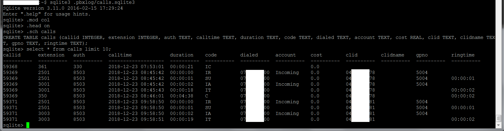
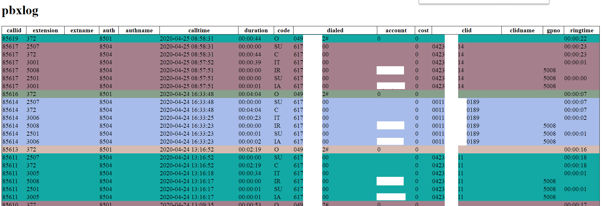

# pbxlog
Log Samsung OfficeServ PABX call records (SMDR) into an SQL database. A simple built-in web interface can be run on top of this database allowing viewing of the data.

This has been tested on a Samsung OfficeServ 7200. I suspect that it would work with similar models.

# Configuration
* The pabx and calls-db configuration items are mandatory. 
* Everthing else is optional. 
* If webui IP/port is supplied then the webserver will be started.

# Screenshots

Database contents:

Built-in webserver:

